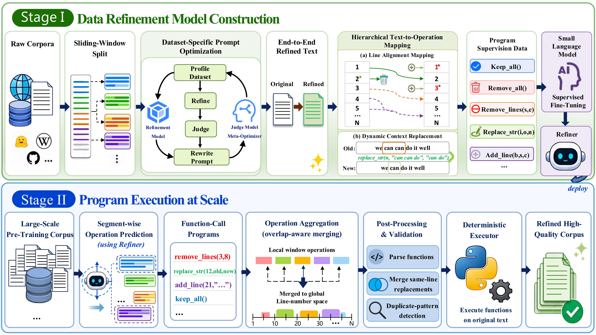
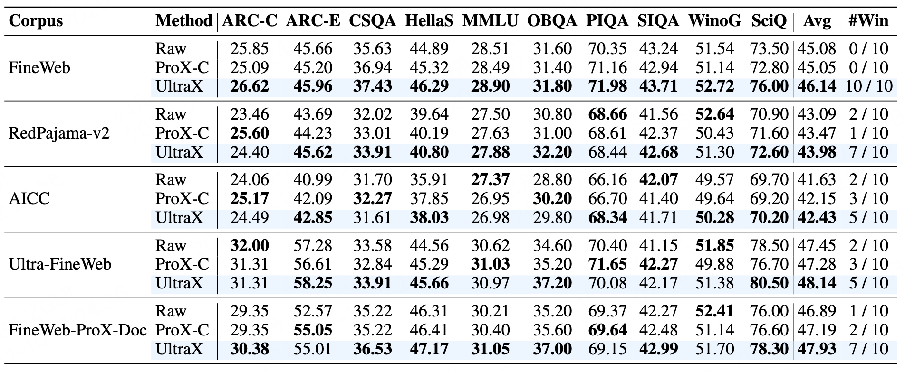
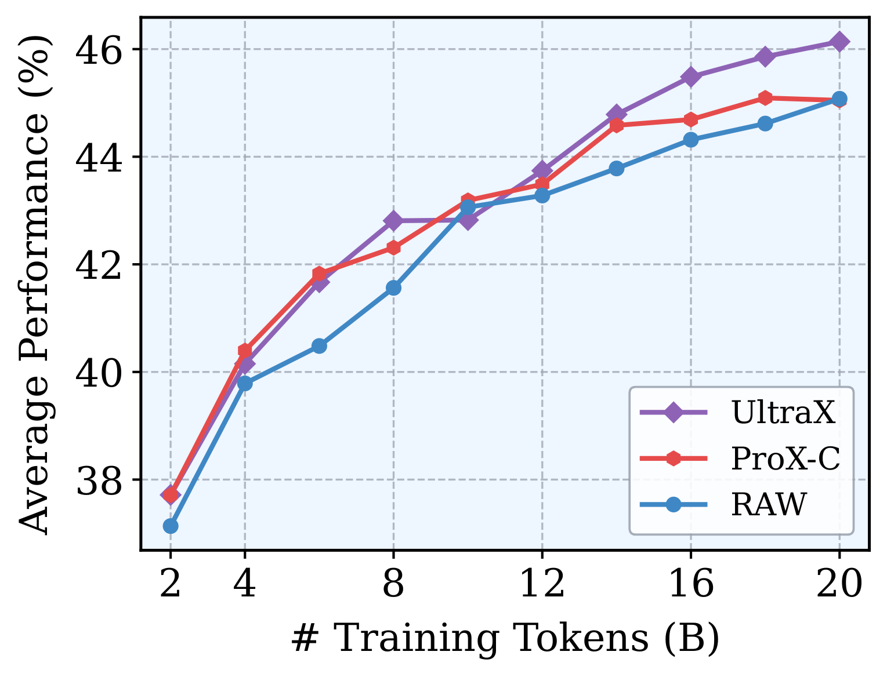

# UltraX: Refining Pre-Training Data at Scale with Adaptive Programmatic Editing
<p align="center">
  <a href="https://huggingface.co/collections/openbmb/ultradata">
    
  </a>
  <br/>
  <a href="https://huggingface.co/collections/openbmb/ultradata">
    
  </a>
</p>

<p align="center">
<a href="https://arxiv.org/abs/2607.08646">📜 Paper</a> |
<a href="https://huggingface.co/datasets/openbmb/UltraX-Preview">🤗 Datasets</a> |
<a href="https://huggingface.co/openbmb/UltraX-0.6B-Preview">🤗 Models</a> |
<a href="https://huggingface.co/collections/openbmb/ultradata">📦 UltraData Collection</a>
</p>

<p align="center">
English |
<a href="README_ZH.md">中文</a>
</p>

## 📚 Introduction

**UltraX** is a function-calling refinement framework for large-scale pre-training data that adaptively generates and executes editing functions for efficient instance-wise refinement. Instead of relying on end-to-end text rewriting, UltraX trains a lightweight refinement model to predict structured editing operations — including insertion, deletion, and modification — which are then deterministically executed on the original text.



**Key Features:**

- **Complete Function Space:** Covers insertion (`add_line`), deletion (`remove_lines`, `remove_all`), and modification (`replace_str`), enabling fine-grained instance-level editing beyond delete-only approaches.
- **Reliable Seed Supervision:** Uses expert LLM end-to-end refinement + LAM (Line Alignment and Mapping) + DCR (Dynamic Context Replacement) to produce high-quality structured program supervision.
- **Robust Large-Scale Execution:** Sliding-window inference with overlap-aware aggregation, ambiguity filtering, same-line operation merging, and duplicate pattern detection ensure reliable execution at scale.
- **State-of-the-Art Performance:** UltraX achieves the best average performance across all five corpora in 1B-model pre-training experiments, with improvements exceeding 2% on multiple datasets.

## 📢 News

- **[2026.07.13]** UltraX codebase, refinement model, and refined datasets are now available on GitHub and Hugging Face. 🚀🚀🚀
- **[2025.07.10]** UltraX technical report is available on [arXiv](https://arxiv.org/abs/2607.08646). 🔥🔥🔥

## 💡 Highlights

- **Function-Calling Refinement:** Instead of end-to-end text rewriting, UltraX predicts structured editing operations (`keep_all`, `remove_all`, `remove_lines`, `replace_str`, `add_line`), enabling fine-grained instance-level editing with deterministic execution.
- **LAM + DCR Pipeline:** Line Alignment and Mapping (LAM) aligns original and refined text at line level, while Dynamic Context Replacement (DCR) converts character-level edits into reliable `replace_str` operations with unique context anchoring.
- **Robust Large-Scale Execution:** Sliding-window inference with overlap-aware aggregation, ambiguity filtering, same-line operation merging, and duplicate pattern detection ensure reliable execution at scale.
- **State-of-the-Art Performance:** UltraX achieves the best average performance across all five corpora in 1B-model pre-training experiments, with improvements exceeding 2% on multiple datasets and superior data efficiency.

## 📋 Pipeline Overview

The UltraX pipeline consists of two main stages:

### Stage I: Refinement Model Construction

| Step | Module | Description |
|------|--------|-------------|
| 1 | `seed_preprocessing/` | Sliding window splitter for long documents (12K token windows, 20% overlap) |
| 2 | `prompt_optimization/` | Dataset-adaptive prompt optimization with profiling, iterative refinement, and regression testing |
| 3 | `e2e_refinement/` | Batch end-to-end text refinement via expert LLM API |
| 4 | `function_construction/` | LAM + DCR: convert (original, refined) pairs into structured function call training data |
| 5 | `sft_data_building/` | Edit-weighted sampling + system instruction injection |
| 6 | `model_training/` | Full-parameter SFT with ms-swift + DeepSpeed ZeRO3 |

### Stage II: Large-Scale Program Execution

| Step | Module | Description |
|------|--------|-------------|
| 7 | `inference/` | Multi-GPU data-parallel vLLM inference with sliding window segmentation |
| 8 | `post_processing/` | Function parsing, validation, post-processing, and deterministic execution |

## 📈 Evaluation Results

We pretrain 1B-parameter MiniCPM models from scratch on 20B tokens and evaluate on 10 benchmarks with zero-shot setting.

<div align="center">
  
</div>

UltraX achieves the **highest average performance on all five corpora**, winning 34 out of 50 task-corpus pairs.

<div align="center">
  
  <p><i>Average downstream performance on FineWeb under different training token budgets.</i></p>
</div>

## 🚀 Quick Start

### Setup

```bash
git clone https://github.com/BIGWangYuDong/UltraX.git
cd UltraX
conda create -n ultrax python=3.10
conda activate ultrax
pip install -r requirements.txt
```

For inference, you also need vLLM:

```bash
pip install vllm
```

For model training, install ms-swift:

```bash
pip install ms-swift
```

### Stage I: Refinement Model Construction

#### Step 1: Seed Data Preprocessing

Split long documents into overlapping windows at line boundaries:

```bash
python stage1_model_construction/seed_preprocessing/sliding_window_splitter.py \
    --input_dir /path/to/seed_data \
    --output_dir /path/to/output \
    --tokenizer_path /path/to/tokenizer \
    --max_tokens 12000 \
    --overlap_ratio 0.2
```

#### Step 2: Dataset-Adaptive Prompt Optimization

Automatically optimize refinement prompts for each dataset:

```bash
cd stage1_model_construction/prompt_optimization
python main.py \
    --api-key $API_KEY \
    --datasets fineweb redpajama \
    --max-iterations 200 \
    --batch-size 5
```

#### Step 3: End-to-End Refinement

Refine seed data using optimized prompts via expert LLM:

```bash
python stage1_model_construction/e2e_refinement/refine_dataset.py \
    --input_dir /path/to/seed_data \
    --output_dir /path/to/refined_output \
    --prompt_dir /path/to/optimized_prompts \
    --api_url $API_URL \
    --api_key $API_KEY \
    --model deepseek-v3
```

#### Step 4: Function Construction (LAM + DCR)

Convert (original, refined) text pairs into structured function call training data:

```bash
python stage1_model_construction/function_construction/function_construction.py \
    --input_dir /path/to/refined_data \
    --output_dir /path/to/training_data \
    --num_workers 64
```

#### Step 5: SFT Data Building

Sample training data by operation combination and add system instructions:

```bash
python stage1_model_construction/sft_data_building/sample_and_format.py \
    --train_data_dir /path/to/training_data \
    --output_dir /path/to/sft_data
```

#### Step 6: Model Training

Train the refinement model with ms-swift:

```bash
bash stage1_model_construction/model_training/train.sh
```

> **Note:** Edit the paths in `train.sh` before running. See the script for detailed hyperparameter settings.

### Stage II: Large-Scale Program Execution

#### Step 7: Inference

Run multi-GPU data-parallel inference with vLLM:

```bash
python stage2_large_scale_execution/inference/inference.py \
    --input_dir /path/to/raw_data \
    --model_path /path/to/trained_model \
    --output_dir /path/to/inference_output \
    --num_gpus 8 \
    --max_chars 48000
```

#### Step 8: Post-Processing & Execution

Parse, validate, and execute the predicted cleaning operations:

```bash
python stage2_large_scale_execution/post_processing/post_process_and_execute.py \
    --input_dir /path/to/inference_output \
    --output_dir /path/to/cleaned_data \
    --num_workers 128
```

The output contains 3 columns: `original`, `cleaned`, `processed_functions`.

## 🔧 Function Space

| Function | Description |
|----------|-------------|
| `keep_all()` | Document needs no modification |
| `remove_all()` | Entire document is valueless (e.g., error pages, login walls) |
| `remove_lines(start, end)` | Remove consecutive lines from start to end (inclusive) |
| `replace_str(line, old, new)` | Replace a substring within a specific line |
| `add_line(base, sub_idx, content)` | Insert a new line near the base position |

## ❤️ Acknowledgements

We thank the following projects for their great contributions:

- [ms-swift](https://github.com/modelscope/ms-swift) — Model training framework
- [vLLM](https://github.com/vllm-project/vllm) — High-throughput inference engine
- [ProX](https://github.com/GAIR-NLP/ProX) — Pioneering programmatic data refinement
- [LightEval](https://github.com/huggingface/lighteval) — Evaluation framework

## 📖 Citation

If you find our work useful, please consider citing:

```bibtex
@misc{ultrax2026,
  title={UltraX: Refining Pre-Training Data at Scale with Adaptive Programmatic Editing},
  author={Xinlong Zhao and Dongsheng Liu and Hengyu Zhao and Zixuan Fu and Zheng Wang and Jie Cai and Jie Zhou and Qiang Ma and Xuanhe Zhou and Xu Han and Yudong Wang and Zhiyuan Liu},
  year={2026},
  eprint={2607.08646},
  archivePrefix={arXiv},
  primaryClass={cs.CL},
}
```

## 📜 License

This project is licensed under the [Apache 2.0](./LICENSE) license.

**No unauthorized unchanged redistribution:** Without prior written permission from the original authors (or this organization), any institution, organization, or third-party platform is strictly prohibited from directly reposting, mirroring, re-hosting, or commercially repackaging and republishing any artifacts of this project in any form.
